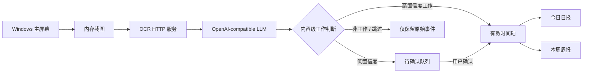

<div align="center">
  
  <h1>WorkTrace</h1>
  <p><strong>本地优先的 Windows AI 工作轨迹记录与日报生成助手</strong></p>
  <p>定时截图 · OCR 识别 · 内容级工作判断 · 时间轴 · 日报 / 周报</p>
</div>

<p align="center">
  <a href="https://github.com/teachershuang/worktrace/releases"></a>
  <a href="https://github.com/teachershuang/worktrace/releases"></a>
  <a href="https://github.com/teachershuang/worktrace/stargazers"></a>
  <a href="https://github.com/teachershuang/worktrace/issues"></a>
  
  
  <a href="LICENSE"></a>
</p>

<p align="center">
  <a href="#快速开始">快速开始</a> ·
  <a href="#功能">功能</a> ·
  <a href="#配置">配置</a> ·
  <a href="#命令行">命令行</a> ·
  <a href="#开发与构建">开发与构建</a> ·
  <a href="#路线图">路线图</a>
</p>


## WorkTrace 是什么

WorkTrace 是一个运行在 Windows 本机的个人工作记录工具。它会在配置的工作时间段内定时获取主屏幕截图，通过本地或局域网 OCR 服务识别文字，再使用 OpenAI-compatible 大模型理解当前工作内容，最终形成可确认、可追溯的工作时间轴，并生成 Markdown 日报和周报。

它不是员工监控平台，也不是云端 SaaS。WorkTrace 不提供自有云服务、团队管理或云同步，事件、配置和报告默认保存在本机。

WorkTrace 不按应用名简单判断是否工作。浏览器、微信、邮箱和飞书等混合应用会结合窗口标题、OCR 文本、最近上下文和已识别项目进行内容级判断：

- 高置信度工作内容进入有效时间轴。
- 低置信度内容进入待确认队列。
- 明确的非工作内容不会进入日报。
- 日报与周报只基于有效时间轴生成，不补写不存在的事项。

## 功能

### 自动记录

- 在指定工作时间段内按周期截图并记录。
- 获取当前应用名、窗口标题和系统空闲时间。
- 支持开始、暂停、恢复、停止和立即记录一次。
- 锁屏、WorkTrace 自身窗口、系统空闲和指定全屏应用可自动跳过。
- 截图默认仅在内存中处理，不主动保存原图。

### OCR 与 AI 理解

- 支持 HTTP OCR 服务，内置 `multipart` 和 `paddle_json` 两种协议。
- 支持 OpenAI-compatible `/chat/completions` 模型服务。
- OCR 失败时可降级使用应用名和窗口标题进行粗粒度判断。
- 分类结果包含类别、项目、标题、摘要、置信度和待确认标记。
- Prompt 独立存放在 `prompts/`，便于审查和修改。

### 时间轴与报告

- 保存原始事件、有效事件和待确认事件。
- 自动合并时间接近、项目相同、类别相同且文本相似的事件。
- 支持查看历史日期、搜索和批量确认待处理事件。
- 根据真实时间轴生成今日日报和本周周报。
- 报告以 Markdown 保存，可在控制台预览和编辑。

### Windows 桌面体验

- `WorkTrace.exe` 以小型原生窗口启动，不占用全屏。
- 关闭主窗口后最小化到系统托盘，后台任务继续运行。
- 桌面宠物实时显示待命、记录、暂停、待确认、等待工作时段和服务异常状态。
- 点击桌宠可打开快捷面板，执行开始/恢复、暂停、立即记录、生成日报和打开控制台。
- 支持开机自启和独立命令行诊断工具。

### 桌宠状态

| 状态 | 含义 |
| --- | --- |
| `待命中` | 后台循环尚未启动，可点击桌宠开始记录 |
| `记录中` | 位于工作时间段，后台循环正在运行 |
| `已暂停` | 用户暂停了自动截图和识别 |
| `待确认 N` | 有低置信度事件等待人工确认 |
| `等待工作时段` | 后台循环已启动，但当前不在记录时间段 |
| `OCR 异常 / 模型异常` | 服务测试失败或最近记录发生服务错误 |

## 工作流程



## 快速开始

### 方式一：使用 Windows 发布包

1. 从 [GitHub Releases](https://github.com/teachershuang/worktrace/releases) 下载 `WorkTrace-v*-windows-x64.7z`。
2. 将压缩包完整解压到一个可写目录，不要直接在压缩软件中运行 EXE。
3. 双击 `WorkTrace.exe`。首次启动会在 EXE 同目录生成 `config.yaml`。
4. 打开左侧“接口配置”，填写 OCR 地址、LLM 地址、API Key 和模型名称。
5. 分别执行“测试 OCR”和“测试 LLM”。
6. 点击主界面或桌宠中的“开始 / 恢复”，等待第一个记录周期，或点击“立即记录一次”。

发布包是免安装绿色版。当前版本还没有安装向导、数字签名和自动升级功能。

### 方式二：从源码运行

建议使用 Conda 管理 Python 环境：

```powershell
git clone https://github.com/teachershuang/worktrace.git
cd worktrace

conda create -n worktrace python=3.11 -y
conda activate worktrace
pip install -r requirements.txt

Copy-Item config.example.yaml config.yaml
python main.py doctor --config .\config.yaml --skip-services
python main.py desktop --config .\config.yaml
```

如果已有兼容的 Conda 环境，可以直接复用，不需要重复创建。

## 首次使用

### 1. 配置接口

最小可用配置如下：

```yaml
llm:
  base_url: "http://127.0.0.1:8000/v1"
  api_key: "replace-with-your-api-key"
  model: "qwen3.6-35b-a3b"
  timeout_seconds: 60
  trust_env: false

ocr:
  url: "http://192.168.8.30:9000/ocr"
  timeout_seconds: 30
  protocol: "multipart"
  trust_env: false

recording:
  work_periods:
    - "09:00-12:00"
    - "13:30-18:00"
  screenshot_interval_seconds: 300
  short_poll_interval_seconds: 5
  idle_skip_minutes: 10
  enable_tray: false
  skip_when_screen_locked: true
  skip_own_windows: true
  fullscreen_skip_apps: []

storage:
  data_dir: "data"
  report_output_dir: "data/reports"
  log_dir: "logs"
```

`enable_tray: false` 是推荐的桌面模式，会显示原生控制台、系统托盘和动态桌宠。设置为 `true` 时使用仅托盘后台模式。

### 2. 测试服务

在控制台的“服务诊断”页面执行 OCR 和 LLM 测试，也可以运行：

```powershell
.\WorkTrace-cli.exe doctor --config .\config.yaml
.\WorkTrace-cli.exe test-ocr --config .\config.yaml
.\WorkTrace-cli.exe test-llm --config .\config.yaml
```

### 3. 产生第一条记录

点击桌宠打开快捷面板，选择“立即记录一次”。一次完整记录流程为：

```text
截图 -> OCR -> LLM 分类 -> 原始事件 -> 有效时间轴或待确认队列
```

如果当前是 WorkTrace 自身窗口、处于锁屏状态、超过空闲阈值或不在工作时段，自动循环会跳过本次截图；“立即记录一次”用于主动验证完整链路。

### 4. 处理待确认事件

打开“待确认”页面，对低置信度事件标记为“工作”或“非工作”。只有标记为工作的事件才会进入有效时间轴并参与报告生成。

### 5. 生成日报和周报

在“报告”页面生成日报或周报。报告保存在 `data/reports/`，也可以使用命令行：

```powershell
.\WorkTrace-cli.exe daily-report --config .\config.yaml
.\WorkTrace-cli.exe weekly-report --config .\config.yaml
```

## 配置

### LLM

| 字段 | 说明 |
| --- | --- |
| `base_url` | OpenAI-compatible API 根地址，通常以 `/v1` 结尾 |
| `api_key` | 服务端要求的 API Key；不要提交到 Git |
| `model` | `/chat/completions` 请求使用的模型名称 |
| `timeout_seconds` | 单次模型请求超时 |
| `trust_env` | 是否读取系统代理环境变量，局域网服务建议设为 `false` |

### OCR

| 字段 | 说明 |
| --- | --- |
| `url` | OCR HTTP 地址 |
| `protocol: multipart` | 使用 `file=screenshot.png` 上传截图 |
| `protocol: paddle_json` | 使用 `documents[].pages[].image_base64` JSON 结构 |
| `timeout_seconds` | OCR 请求超时 |
| `trust_env` | 是否读取系统代理环境变量 |

### 记录策略

| 字段 | 说明 |
| --- | --- |
| `work_periods` | 自动记录时间段，可配置多个 |
| `screenshot_interval_seconds` | 正常记录周期，默认 300 秒 |
| `short_poll_interval_seconds` | 暂停、空闲和非工作时段的状态轮询周期 |
| `idle_skip_minutes` | 系统持续空闲达到该时间后跳过截图 |
| `skip_when_screen_locked` | Windows 锁屏时跳过截图 |
| `skip_own_windows` | WorkTrace 位于前台时跳过自身截图 |
| `fullscreen_skip_apps` | 指定全屏程序列表，例如播放器或演示软件 |

配置也可以在控制台中修改。保存后运行时会热更新；正在运行的后台循环会使用新配置重启。

## 命令行

发布包中的 `WorkTrace-cli.exe` 和源码入口 `python main.py` 使用相同命令：

| 命令 | 用途 |
| --- | --- |
| `desktop` | 启动原生控制台、托盘和桌宠 |
| `tray` | 启动仅托盘后台模式 |
| `console` | 仅启动本地 FastAPI 控制台 |
| `doctor` | 检查配置、目录、依赖、OCR 和 LLM |
| `test-ocr` | 测试 OCR 服务 |
| `test-llm` | 测试 LLM 服务 |
| `record-once` | 立即执行一次截图、OCR、分类和保存 |
| `start` | 在当前终端启动自动记录循环 |
| `pause` / `resume` / `stop` | 控制记录状态 |
| `today-timeline` | 查看今日有效时间轴 |
| `review-list` | 查看今日待确认事件 |
| `review-mark-work` | 将待确认事件标记为工作 |
| `review-mark-nonwork` | 将待确认事件标记为非工作 |
| `daily-report` | 生成今日日报 |
| `weekly-report` | 生成本周周报 |

示例：

```powershell
.\WorkTrace-cli.exe record-once --config .\config.yaml --verbose
.\WorkTrace-cli.exe today-timeline --config .\config.yaml
.\WorkTrace-cli.exe review-list --config .\config.yaml
```

## 本地数据与隐私

默认目录：

```text
data/
  events/
    YYYY-MM-DD.raw.jsonl        # 每次分析得到的原始事件
    YYYY-MM-DD.effective.jsonl  # 有效工作事件
    YYYY-MM-DD.review.jsonl     # 待确认事件
  reports/
    YYYY-MM-DD-daily.md
    YYYY-MM-DD_to_YYYY-MM-DD-weekly.md
  runtime_state.json
logs/
  worktrace.log
```

隐私边界：

- WorkTrace 不会把数据发送到 WorkTrace 自有服务器。
- 截图默认不保存，但会发送到你配置的 OCR 服务。
- OCR 文本、窗口信息和最近工作上下文会发送到你配置的 LLM 服务。
- 如果 OCR 或 LLM 地址位于其他机器，相关内容会离开当前电脑并进入该服务所在网络。
- 请不要将真实 API Key、私人截图、`data/` 或日志提交到公开仓库。

在公司内部部署时，应由使用方自行评估 OCR、模型服务和网络环境的数据处理规则。

## 项目结构

```text
worktrace/
  capture/        屏幕截图、活跃窗口、空闲与前台保护
  classifier/     屏幕内容分类流程
  config/         YAML 配置、校验和日志
  llm/            OpenAI-compatible LLM 客户端
  ocr/            OCR HTTP 客户端
  report/         日报与周报生成
  runtime/        记录器、后台循环、运行状态、开机自启
  timeline/       JSONL 事件存储与时间轴合并
  ui/             CLI、FastAPI、原生窗口、托盘和桌宠
  ui/static/      控制台与桌宠前端资源
prompts/          分类、合并、日报和周报 Prompt
tests/            单元测试与集成测试
scripts/          Windows 构建脚本
docs/images/      项目截图
main.py           程序入口
```

## 开发与构建

### 运行测试

```powershell
python -m unittest discover -s tests
python -m compileall worktrace main.py tests
node --check worktrace\ui\static\app.js
node --check worktrace\ui\static\pet.js
```

### 构建 Windows 绿色包

在已激活并安装依赖的 Conda 环境中运行：

```powershell
pip install -r requirements-build.txt
.\scripts\build_windows.ps1 -Clean -ReuseCurrentPython
```

产物目录：

```text
dist/WorkTrace/
  WorkTrace.exe
  WorkTrace-cli.exe
  config.example.yaml
  config.lan.example.yaml
  _internal/
```

创建发布压缩包：

```powershell
7z a -t7z -mx=9 dist\WorkTrace-v0.4.0-windows-x64.7z .\dist\WorkTrace\*
```

## 常见问题

### 点击开始后为什么没有产生事件？

检查是否处于配置的工作时间段，当前窗口是否为 WorkTrace，自身是否长时间空闲，以及前台程序是否在 `fullscreen_skip_apps` 中。可先执行“立即记录一次”验证完整链路。

### OCR 或模型显示异常怎么办？

在“服务诊断”页面重新测试连接，确认地址、端口、API Key、模型名称和协议。也可以运行：

```powershell
.\WorkTrace-cli.exe doctor --config .\config.yaml --verbose
```

详细错误保存在 `logs/worktrace.log`。

### 为什么事件进入了待确认？

当模型无法可靠判断是否为工作，或置信度较低时，WorkTrace 不会强行写入日报。请在待确认页面人工处理。

### 是否支持 macOS 或 Linux？

当前只维护 Windows 10/11。屏幕采集、活跃窗口、锁屏判断、托盘和桌宠均按 Windows 实现。

## 路线图

- [ ] Windows 安装器与首次启动配置向导
- [ ] OCR/LLM 诊断历史、延迟统计和自动重试
- [ ] 会议状态与媒体播放识别
- [ ] Windows 原生通知提醒
- [ ] 多显示器与区域截图
- [ ] 截图脱敏规则
- [ ] 更强的语义时间轴合并
- [ ] 报告版本历史与富文本编辑
- [ ] 数字签名、发布通道和自动升级

## 参与项目

欢迎通过 [Issues](https://github.com/teachershuang/worktrace/issues) 报告问题或提出需求，也欢迎提交 Pull Request。

提交前请确认：

- 新功能包含必要测试。
- `python -m unittest discover -s tests` 通过。
- 不包含真实 API Key、运行数据、日志或私人截图。
- Windows 用户可按 README 复现运行方式。

如果 WorkTrace 对你有帮助，可以在 [GitHub](https://github.com/teachershuang/worktrace) 点一个 Star，便于后续关注版本更新。

## 许可证

WorkTrace 使用 [MIT License](LICENSE)。
