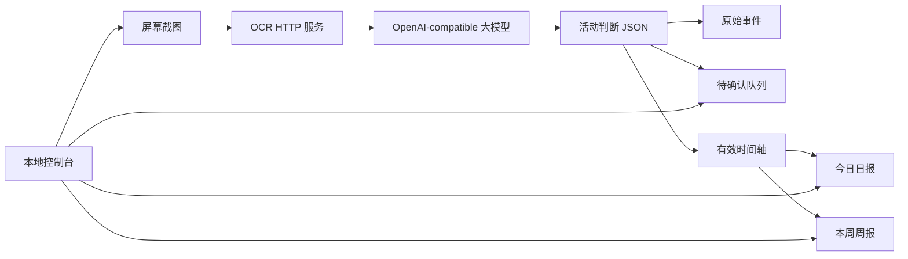

# WorkTrace


[](https://github.com/teachershuang/worktrace/releases)
[](https://github.com/teachershuang/worktrace/stargazers)
[](https://github.com/teachershuang/worktrace/issues)
[](https://www.python.org/)
[](https://www.microsoft.com/windows)
[](LICENSE)

WorkTrace 是一个 Windows 优先、本地运行的日报生成助手。它会按配置定时截取主屏幕，把截图发送给本地或局域网 OCR 服务识别文字，再调用 OpenAI-compatible 大模型理解当前屏幕内容，自动沉淀工作时间轴，并生成日报、周报。

它面向个人或公司内部使用，不是云端 Web 平台，也不会把数据上传到 WorkTrace 自有服务器。

## 为什么做这个

传统时间记录工具通常按应用名判断工作状态，但这在真实办公场景里很容易失真：微信、浏览器、邮箱、飞书、文档工具既可能是工作，也可能是摸鱼。WorkTrace 的核心目标是做“内容级工作识别”：

- 应用名和窗口标题只作为上下文，不作为最终判断依据。
- OCR 文本用于识别客户、项目、需求、代码、接口、会议、部署、测试、合同、文档、调研等工作内容。
- 高置信度工作事件进入有效时间轴。
- 低置信度事件进入待确认队列。
- 日报和周报只基于真实记录和用户确认后的事件生成，不编造工作内容。

## 当前能力

当前版本是可运行的 MVP，已经覆盖桌面端主流程：

- Windows 桌面应用，可打包为 `WorkTrace.exe`。
- 本地控制台，小窗口启动，左侧导航，右侧内容切换。
- 系统托盘、桌面宠物、开机自启基础能力。
- OCR 和 OpenAI-compatible LLM 连通性测试。
- 支持立即记录、定时记录、暂停、开始/恢复。
- 支持待确认事件、批量标记工作/非工作。
- 支持生成今日日报和本周周报。
- 支持在控制台编辑 OCR/LLM 地址、模型名、API Key、截图间隔、工作时间段等配置。
- 配置保存后支持运行时热更新，不需要每次手动重启。
- 诊断面板显示本地存储、OCR、LLM、最近活动和今日事件状态。

## 截图

| 控制台 | 桌面体验 |
| --- | --- |
|  | 内置 Q 版任务助手和小猫素材，用于桌面宠物与品牌视觉。 |

## 工作流程



## 快速开始

### 下载 Windows 发布包

从 [GitHub Releases](https://github.com/teachershuang/worktrace/releases) 下载 `WorkTrace-v*-windows-x64.7z`，使用 7-Zip 解压，编辑 `WorkTrace.exe` 同目录下的 `config.yaml`，然后启动：

```powershell
.\WorkTrace.exe
```

如果单个压缩包下载不稳定，可以下载同版本所有 `.part*` 分卷文件，放在同一个目录后，用 7-Zip 解压 `part01`。

同一目录内也提供命令行诊断工具：

```powershell
.\WorkTrace-cli.exe doctor --config .\config.yaml
.\WorkTrace-cli.exe test-ocr --config .\config.yaml
.\WorkTrace-cli.exe test-llm --config .\config.yaml
.\WorkTrace-cli.exe record-once --config .\config.yaml
```

### 从源码运行

```powershell
git clone https://github.com/teachershuang/worktrace.git
cd worktrace
python -m venv .venv
.\.venv\Scripts\Activate.ps1
pip install -r requirements.txt
Copy-Item config.example.yaml config.yaml
python main.py doctor --skip-services
python main.py desktop
```

## 配置示例

最小 `config.yaml`：

```yaml
llm:
  base_url: "http://127.0.0.1:8000/v1"
  api_key: "replace-with-your-api-key"
  model: "qwen3.6-35b-a3b"
  timeout_seconds: 60
  trust_env: false

ocr:
  url: "http://192.168.8.30:9000/ocr"
  timeout_seconds: 30
  protocol: "multipart"
  trust_env: false

recording:
  work_periods:
    - "09:00-12:00"
    - "13:30-18:00"
  screenshot_interval_seconds: 300
  short_poll_interval_seconds: 5
  idle_skip_minutes: 10
  enable_tray: false

storage:
  data_dir: "data"
  report_output_dir: "data/reports"
  log_dir: "logs"
```

OCR 协议：

- `multipart`：以 `file=screenshot.png` 方式上传截图。
- `paddle_json`：以 `documents[].pages[].image_base64` 方式上传截图，并通过 `/health` 测试连通性。

桌面控制台里的“接口配置”页面也可以直接修改 OCR、LLM 和记录配置。

## 常用命令

```powershell
python main.py desktop
python main.py tray
python main.py console
python main.py doctor
python main.py test-ocr
python main.py test-llm
python main.py record-once
python main.py start
python main.py pause
python main.py resume
python main.py today-timeline
python main.py review-list
python main.py daily-report
python main.py weekly-report
```

## Windows 打包

```powershell
.\scripts\build_windows.ps1 -Clean
```

打包产物：

```text
dist/WorkTrace/
  WorkTrace.exe
  WorkTrace-cli.exe
  config.example.yaml
  config.lan.example.yaml
```

创建发布压缩包：

```powershell
7z a -t7z -mx=9 dist\WorkTrace-v0.3.0-windows-x64.7z .\dist\WorkTrace\*
```

## 项目结构

```text
worktrace/
  capture/        屏幕截图、活跃窗口信息、空闲检测
  classifier/     大模型活动识别流程
  config/         YAML 配置与日志初始化
  llm/            OpenAI-compatible LLM 客户端
  ocr/            HTTP OCR 客户端
  report/         日报和周报生成
  runtime/        记录器、后台循环、运行状态、开机自启
  timeline/       JSONL 事件存储与时间轴合并
  ui/             CLI、FastAPI 控制台、桌面窗口、托盘、桌宠
  ui/static/      控制台前端和吉祥物素材
prompts/          大模型提示词
tests/            单元测试和集成测试
scripts/          Windows 构建脚本
docs/images/      README 截图
```

## 本地数据

运行数据默认保存在本机：

```text
data/events/YYYY-MM-DD.raw.jsonl
data/events/YYYY-MM-DD.effective.jsonl
data/events/YYYY-MM-DD.review.jsonl
data/reports/*.md
data/runtime_state.json
logs/worktrace.log
```

这些数据不会提交到仓库，也不应该进入发布包。

## 路线图

- Windows 前台状态判断：锁屏、全屏、会议、媒体播放跳过规则。
- 桌面宠物动作面板、通知提醒和状态动画。
- 多屏截图与区域截图。
- OCR 前截图脱敏。
- 更强的语义级时间轴合并。
- Windows 安装器、签名、自动更新和发布通道。
- 原生报告编辑器与报告版本历史。

## 参与开发

欢迎提交 Issue 和 Pull Request。本地开发建议先运行：

```powershell
python -m unittest discover -s tests
python -m compileall worktrace main.py tests
node --check worktrace\ui\static\app.js
```

请不要提交本地 `data/`、`tmp/`、`resources/`、真实 API Key 或私人截图。

## 许可证

本项目使用 MIT License，详见 [LICENSE](LICENSE)。
