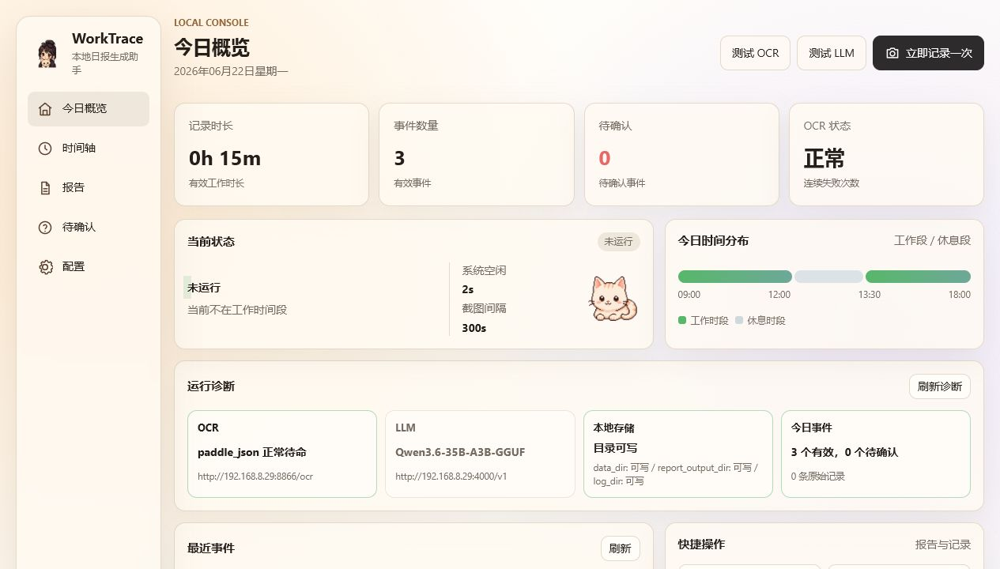
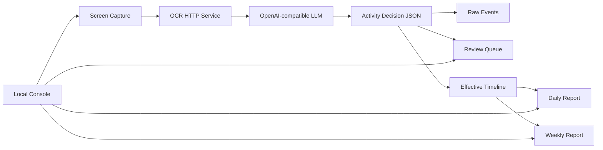

# WorkTrace



[](https://github.com/teachershuang/worktrace/releases)
[](https://github.com/teachershuang/worktrace/stargazers)
[](https://github.com/teachershuang/worktrace/issues)
[](https://www.python.org/)
[](https://www.microsoft.com/windows)
[](LICENSE)

WorkTrace is a Windows-first local daily report assistant. It captures your screen on a schedule, sends screenshots to a local or LAN OCR service, asks an OpenAI-compatible LLM to understand the actual screen content, builds a work timeline, and generates daily or weekly Markdown reports.

The project is designed for personal or internal company use. It is not a cloud web platform, and it does not upload data to WorkTrace-owned servers.

## Why WorkTrace

Most time trackers classify activity by app name. That is not enough: WeChat, browsers, email, Feishu, and documents can all be either work or non-work. WorkTrace focuses on content-level work recognition:

- Active app name and window title are collected as context, not as the final judgment.
- OCR text is used to understand customer, project, code, requirements, meetings, documents, deployment, tests, contracts, and research work.
- High-confidence work events enter the effective timeline.
- Low-confidence events enter a review queue.
- Reports are generated only from recorded and confirmed work events.

## Current Status

WorkTrace is an MVP that already runs end-to-end on Windows:

- Windows desktop app packaged as `WorkTrace.exe`.
- Local desktop console with left-side navigation and a compact app window.
- Desktop pet window and tray integration.
- OCR and OpenAI-compatible LLM connectivity tests.
- One-click record, scheduled recording, pause, start/resume, review queue, daily report, and weekly report.
- Editable OCR/LLM configuration in the console with runtime reload.
- Diagnostics cards for storage, OCR, LLM, recent activity, and event counts.

## Screenshots

| Console | Mascot Assets |
| --- | --- |
|  | Built-in Q-style assistant and cat assets for the desktop experience. |

## Architecture



## Quick Start

### Download Windows Build

Download `WorkTrace-v*-windows-x64.7z` from [GitHub Releases](https://github.com/teachershuang/worktrace/releases), extract it with 7-Zip, then edit `config.yaml` beside `WorkTrace.exe`. If the single archive is unavailable, download all matching `.part*` files and extract `part01`.

```powershell
.\WorkTrace.exe
```

CLI diagnostics are available from the same package:

```powershell
.\WorkTrace-cli.exe doctor --config .\config.yaml
.\WorkTrace-cli.exe test-ocr --config .\config.yaml
.\WorkTrace-cli.exe test-llm --config .\config.yaml
.\WorkTrace-cli.exe record-once --config .\config.yaml
```

### Run From Source

```powershell
git clone https://github.com/teachershuang/worktrace.git
cd worktrace
python -m venv .venv
.\.venv\Scripts\Activate.ps1
pip install -r requirements.txt
Copy-Item config.example.yaml config.yaml
python main.py doctor --skip-services
python main.py desktop
```

## Configuration

Minimal `config.yaml`:

```yaml
llm:
  base_url: "http://127.0.0.1:8000/v1"
  api_key: "replace-with-your-api-key"
  model: "qwen3.6-35b-a3b"
  timeout_seconds: 60
  trust_env: false

ocr:
  url: "http://192.168.8.30:9000/ocr"
  timeout_seconds: 30
  protocol: "multipart"
  trust_env: false

recording:
  work_periods:
    - "09:00-12:00"
    - "13:30-18:00"
  screenshot_interval_seconds: 300
  idle_skip_minutes: 10
  enable_tray: false

storage:
  data_dir: "data"
  report_output_dir: "data/reports"
  log_dir: "logs"
```

Supported OCR protocols:

- `multipart`: sends `file=screenshot.png`.
- `paddle_json`: sends `documents[].pages[].image_base64` and tests health through `/health`.

The desktop console also provides an `接口配置` page for editing OCR and LLM settings without manually opening YAML.

## Commands

```powershell
python main.py desktop
python main.py tray
python main.py console
python main.py doctor
python main.py test-ocr
python main.py test-llm
python main.py record-once
python main.py start
python main.py pause
python main.py resume
python main.py today-timeline
python main.py review-list
python main.py daily-report
python main.py weekly-report
```

## Build

```powershell
.\scripts\build_windows.ps1 -Clean
```

Build output:

```text
dist/WorkTrace/
  WorkTrace.exe
  WorkTrace-cli.exe
  config.example.yaml
  config.lan.example.yaml
```

Create a release archive:

```powershell
7z a -t7z -mx=9 dist\WorkTrace-v0.3.0-windows-x64.7z .\dist\WorkTrace\*
```

## Project Layout

```text
worktrace/
  capture/        Screen capture and active-window metadata
  classifier/     LLM classification pipeline
  config/         YAML settings and logging
  llm/            OpenAI-compatible client
  ocr/            HTTP OCR client
  report/         Daily and weekly report generation
  runtime/        Recorder, loop, state, autostart
  timeline/       JSONL event storage and timeline merge
  ui/             CLI, FastAPI console, desktop window, tray, pet
  ui/static/      Console frontend and mascot assets
prompts/          LLM prompts
tests/            Unit and integration tests
scripts/          Windows build script
docs/images/      README screenshots
```

## Data

Runtime data is stored locally:

```text
data/events/YYYY-MM-DD.raw.jsonl
data/events/YYYY-MM-DD.effective.jsonl
data/events/YYYY-MM-DD.review.jsonl
data/reports/*.md
data/runtime_state.json
logs/worktrace.log
```

Generated data is intentionally not committed.

## Roadmap

- Windows foreground guards: lock screen, fullscreen, meeting, and media skip rules.
- Rich desktop pet actions and notifications.
- Multi-monitor capture and region capture.
- Screenshot redaction before OCR.
- Stronger semantic timeline merge.
- Installer, signing, auto-update, and release channel.
- Native report editor with version history.

## Contributing

Issues and pull requests are welcome. For local development, run:

```powershell
python -m unittest discover -s tests
python -m compileall worktrace main.py tests
node --check worktrace\ui\static\app.js
```

Please do not commit local `data/`, `tmp/`, `resources/`, real API keys, or private screenshots.

## License

MIT License. See [LICENSE](LICENSE).
